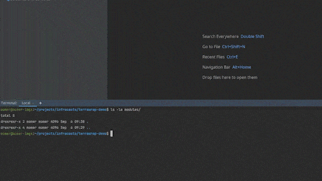

# Terrawrap

Generate Terraform modules for Hashicorp-maintained providers/resources. 



## Supported providers

- [x] [hashicorp/terraform-provider-aws](https://github.com/hashicorp/terraform-provider-aws) resources.

## Install

1. Build it
   1. Clone this repository `bin/terrawrap`
   2. Build `go build .` 
   3. Add the binary to the path 
      (*e.g.* `mv bin/terrawrap /usr/local/bin/terrawrap`)
1. via `go install`:
   ```shell
   go install github.com/infracasts/terrawrap@latest
   ```
  
## Usage

Terrawrap will append or create new files (`main.tf`, `variables.tf`, `outputs.tf`) in your
specified output directory, depending on whether or not they exist already.

Terrawrap will only append data; never truncate or overwrite your existing data.

To get started, just specify a resource type to wrap:

```sh
momer:~/projects/terraform-modules/my-module$ terrawrap generate -a "Mo Omer <mo@infracasts.com>" -o . aws_secretsmanager_secret
2022/09/05 12:04:11 appending to  /home/momer/projects/terraform-modules/my-module/main.tf
2022/09/05 12:04:11 appending to  /home/momer/projects/terraform-modules/my-module/variables.tf
2022/09/05 12:04:11 appending to  /home/momer/projects/terraform-modules/my-module/outputs.tf
Your new module is ready at 
/home/momer/projects/terraform-modules/my-module/
```

### Configuration

`terrawrap` requires a configuration directory to download documentation files to
(see below for details on why). 

By default, this is set to `$HOME/.terrawrap`; and can be overridden by setting
the `--config` filepath to a different directory.

### Documentation downloads

Note that `terrawrap` depends on documentation from providers in order to
generate `variable`s and `output`s with `description`s.

`terrawrap` will download these to the configuration file directory for its own use.

## Support/caveats

1. This project is specifically tailored currently to support the [aws](https://registry.terraform.io/providers/hashicorp/aws/latest/docs)
provider, and is a bit of a proof-of-concept/fun project.
   - As a result, individual resources' schemas are extracted via a fork of the [hashicorp/terraform-provider-aws](https://github.com/hashicorp/terraform-provider-aws)
     implementation. As the provider itself is not meant to be consumed externally (all schemas/provider details are in the `internal` package), 
     a fork was necessary to expose required details.
2. The AWS provider doesn't provide descriptions as part of its schema, so I walked the AST of the markdown documentation that
Hashicorp provides as part of the [hashicorp/terraform-provider-aws](https://github.com/hashicorp/terraform-provider-aws)
repo, and parsed it out via regexp.

## License

Majority of the source code is licensed Apache v2.0. `terraform-aws-provider` code,
including documentation, are licensed under the MPL. 

See the [LICENSES](LICENSES.md) file for details.